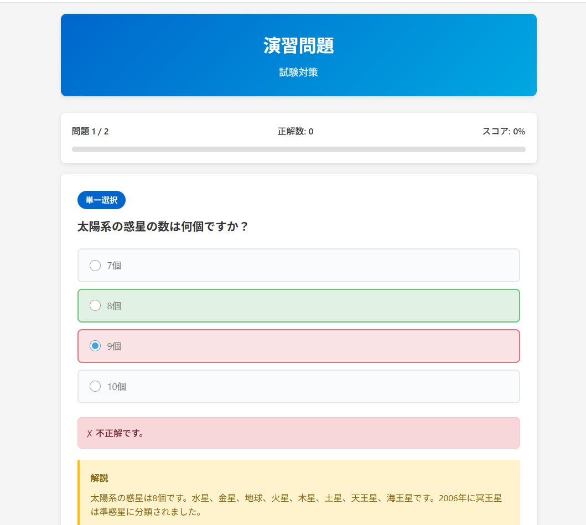

# 演習問題アプリ

シンプルで使いやすいクイズアプリケーションです。単一選択問題と複数選択問題に対応し、リアルタイムでフィードバックを提供します。



## 特徴

- ✅ **直感的なUI**: 選択肢をクリックするだけの簡単操作
- 🎨 **視覚的フィードバック**: 正解は緑、不正解は赤でカラフルに表示
- 📝 **詳細な解説**: 各問題に解説付きで理解を深められる
- 📊 **進捗管理**: リアルタイムでスコアと進捗を確認
- 🔄 **ランダム出題**: 問題順序がシャッフルされるので繰り返し学習に最適
- 📱 **レスポンシブ対応**: スマホでもPCでも快適に利用可能

## 使い方

1. `index.html` をブラウザで開く
2. 選択肢をクリックして回答を選択
3. 「解答を確認」ボタンで答え合わせ
4. 解説を読んで理解を深める
5. 「次の問題へ」で進む
6. 全問終了後、詳細な結果を確認

## カスタマイズ

`questions.js` を編集することで、独自の問題を追加できます：

```javascript
{
    id: 1,
    question: "問題文をここに入力",
    type: "single",  // "single" または "multiple"
    options: ["選択肢1", "選択肢2", "選択肢3", "選択肢4"],
    correct: [1],  // 正解のインデックス（0から始まる）
    explanation: "解説をここに入力"
}
```

## 技術スタック

- HTML5
- CSS3
- Vanilla JavaScript

外部ライブラリ不要で動作するため、すぐに使い始められます。

## ライセンス

MIT License
